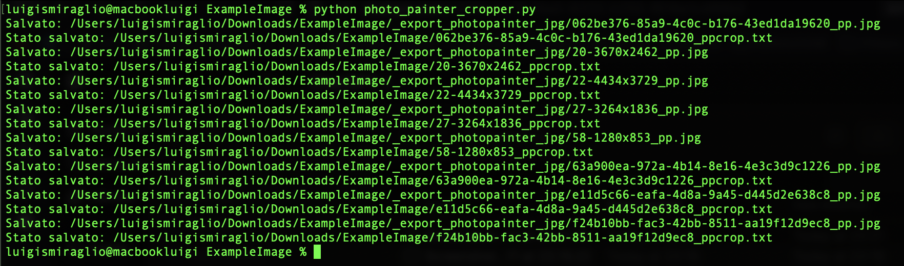
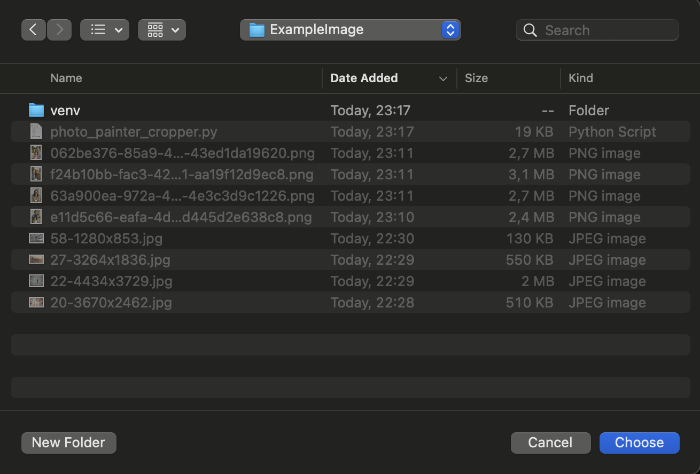
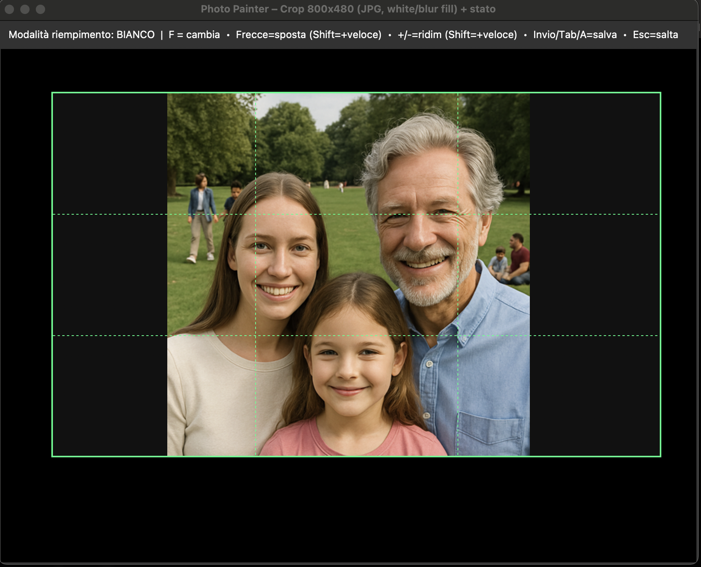
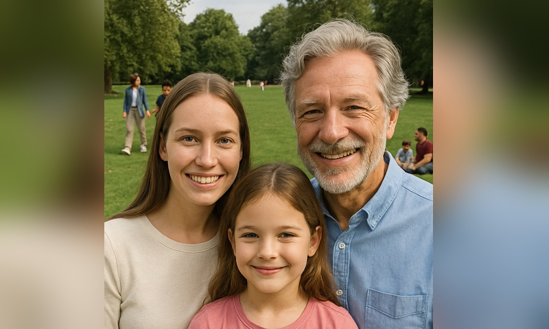
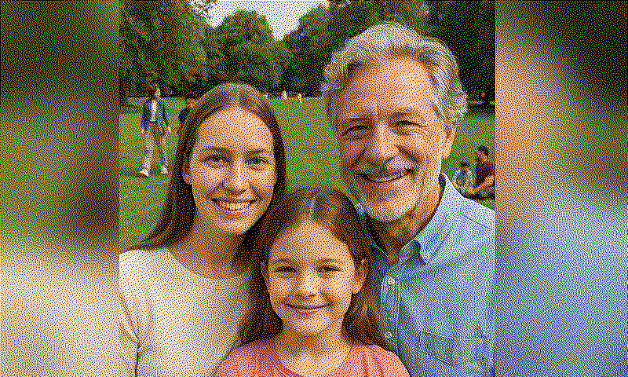
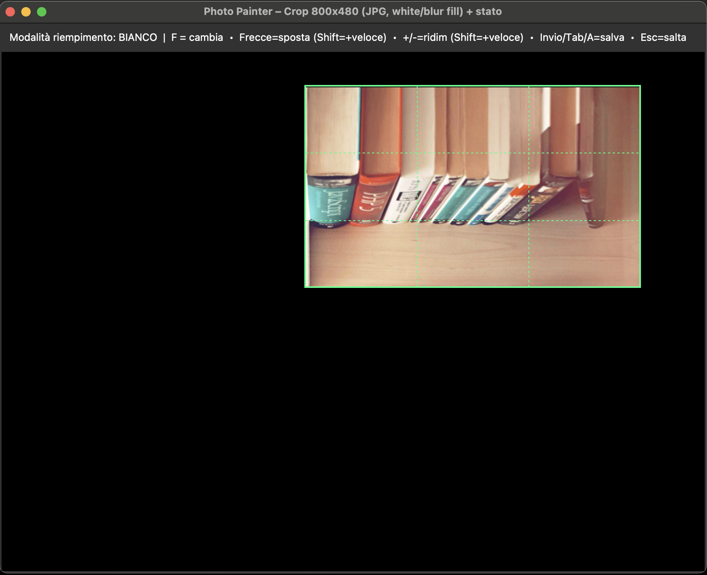
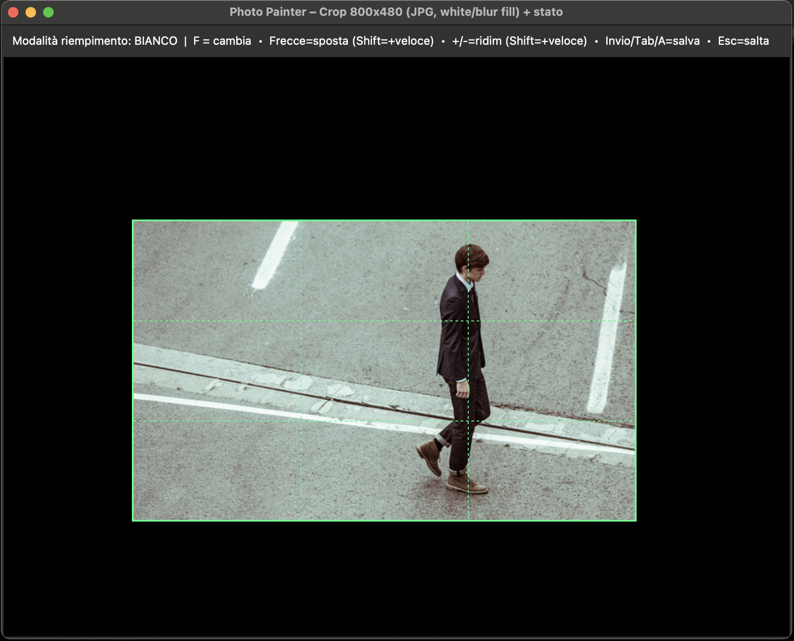
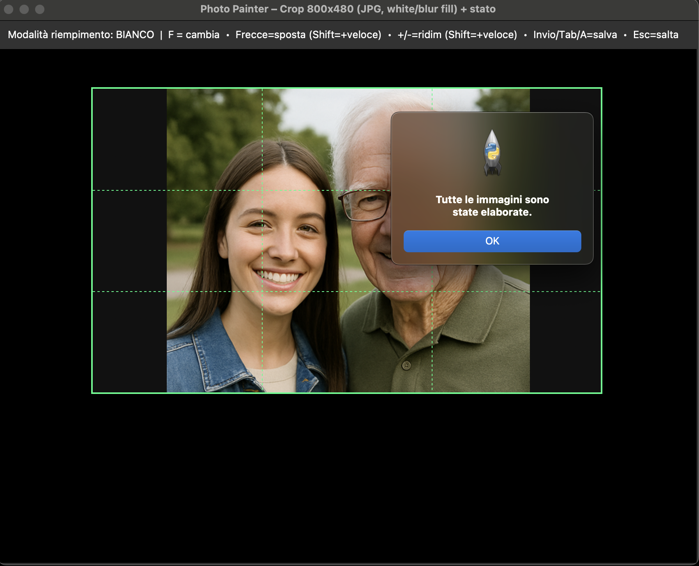

# PhotoPainter Cropper (macOS)

Interactive cropper for the **Waveshare PhotoPainter** (7.3" ACeP,
800×480).

This tool helps you frame the most important area of each photo with a
fixed **800:480** ratio. The crop rectangle may extend **outside** the
image; the empty area is filled with **White** or an auto-generated
**Blurred background**. It was written for my personal workflow on
**macOS**.

The app exports **JPG 800×480** (landscape). For the final device format
(**24-bit BMP**), I use Waveshare’s **official converter**, which
provides better color/tonal results on the 7-color panel than a plain
BMP export.

<figure class="align-center">

<figcaption>Batch run: every Save creates a JPG and a per-image state
file (<code>*_ppcrop.txt</code>).</figcaption>
</figure>

<figure class="align-center">

</figure>

If you crop beyond the border, the image looks like this:

<figure class="align-center">

</figure>

Which becomes:

<figure class="align-center">

</figure>

an the results after cnversion is something like this (obviously is different seen from the photopainter):

<figure class="align-center">

</figure>

Obviously image inside the rectangle remain as they are, just zoommed:

<figure class="align-center">

</figure>

<figure class="align-center">

</figure>

<figure class="align-center">

</figure>

## Key Features

- Fixed **800:480** crop ratio (landscape).
- Crop can go **out of image bounds**; fill with **White** or **Blur**
  (toggle `F`).
- **Per-image state**: saving writes `*_ppcrop.txt` next to the original
  image; running again restores the exact rectangle automatically (great
  for large batches).
- **Mouse**: drag to move, scroll to resize.
- **Keyboard**:
  - Arrows = move (hold **Shift** = faster)
  - `+` / `-` = resize (hold **Shift** = faster)
  - **Enter**, **Tab**, or **A** = save current and go to next
  - **F** = toggle fill (White ↔ Blur)
  - **Esc** = skip image
- Crisp grid lines aligned to device pixels (look straight on Retina).

## Why JPG first, then BMP?

I tested direct BMP export that follows the device format, but the
images looked a bit **flat**. The official Waveshare converter applies
**dithering** and other processing, and it **looks better on the
PhotoPainter**.

Typical workflow:

1.  Use this app to export **JPG 800×480**.
2.  Convert JPG → **24-bit BMP** using the official Waveshare converter.
3.  Copy BMPs to the SD card.

## Batch Conversion to 7-color BMP (parallel)

`converterTo7color_all.sh` runs Waveshare's `convert` over a whole folder.
`convert` is a PyInstaller bundle: each invocation unpacks its archive and
boots a Python interpreter before touching a pixel, and the conversion itself
is single threaded — so converting 2000 photos one by one leaves most of the
CPU idle. The script keeps **N conversions running at the same time** and
starts the next image as soon as one finishes, which on a modern Mac is
roughly N times faster (with N = number of cores).

``` bash
# drop the script next to the `convert` binary, then:
./converterTo7color_all.sh              # every image in this folder, all cores
./converterTo7color_all.sh -i ~/Pictures/pp -j 8
./converterTo7color_all.sh -r -m cut    # recursive, crop instead of scale+pad
./converterTo7color_all.sh -h           # all the options
```

| Option | Meaning |
|---|---|
| `-i DIR` | folder with the images (default: current folder) |
| `-c PATH` | path to the `convert` executable (default: `./convert`, then `DIR/convert`) |
| `-j N` | parallel jobs (default: number of CPU cores) |
| `-m scale\|cut` | scale-and-pad (default) or crop |
| `-d landscape\|portrait` | force orientation (default: from image size) |
| `-D 0\|3` | dithering: none or Floyd-Steinberg |
| `-r` | recurse into sub-folders |
| `-f` | re-convert images that already have an up-to-date BMP |
| `-n` | dry run: list what would be converted |
| `-q` | quiet: only the final summary |

Each output is written next to its source as `<name>_<mode>_output.bmp`.
Other things the script takes care of, on top of the parallelism:

- **Resume**: images whose BMP is already there and newer are skipped, so an
  interrupted batch can just be re-run (`-f` forces a redo).
- Its **own outputs are never re-converted** (`*_scale_output.bmp`,
  `*_cut_output.bmp`), and neither are the `._name.jpg` AppleDouble files that
  SD cards collect.
- Filenames with spaces, quotes or accents are handled, and `.JPG`/`.PNG` in
  uppercase are found too.
- Live progress with ETA, and a final summary listing the failed images with
  the converter's own error output (exit code 1 if anything failed).

## Verifying an Alternative Converter (bit-exact)

If you write your own converter (a script, a faster tool, a rewrite in another
language) the only thing that matters is that the BMP it produces is **the same
file** as the one Waveshare's `convert` produces. `tools/verify_converter.py`
proves it: it runs both converters on the same images in two separate sandbox
folders and compares the results with SHA-256.

``` bash
tools/verify_converter.py -i _export_photopainter_jpg \
    -c ./convert --cand-cmd './mio_script.sh {in}'
```

`{in}` is replaced by the input image; add `{out}` to the template if your tool
takes an explicit output path, otherwise whatever new file it writes is picked
up automatically (so a different output naming is fine).

Useful options: `-n N` (test only N images first), `-j N` (parallel), `--csv
report.csv` (per-file report with both hashes), `--keep DIR` (save the pairs
that differ so you can look at them), `-r` (recursive), `--ref-args '--mode
cut'`.

Before comparing anything it checks that the **reference itself is
deterministic** (same input twice → same bytes); if it were not, a bit-exact
comparison would be meaningless.

When two outputs differ, the report says what kind of difference it is:

| Verdict | Meaning |
|---|---|
| `size` | different dimensions: the geometry/resize stage differs |
| `palette` | the candidate emits colours that are not the 7 device colours |
| `sparse` | <0.5% of pixels: an upstream rounding difference (decoding/resize) |
| `dither` | many pixels, all device colours: the dithering / nearest-colour search differs |

To tell an upstream decoding difference from a real algorithm difference, re-run
with `--lossless-probe`: every source image is first re-encoded to PNG (which any
decoder decodes identically), so if the outputs match on PNG but not on the
original JPEGs, the JPEG decoder is the culprit, not the conversion.

A `PASS` means every BMP you would copy to the SD card is identical, bit for
bit, to the official converter's output — for **those** files. It is empirical
proof about your corpus, not a proof for every possible future image: keep the
harness around and re-run it whenever the converter, a library, or the machine
changes.

## Samples and Outputs Included

- Example **input** photos (both portrait and landscape) live under
  `samples/`.
- Example **outputs** from this tool (JPG 800×480) are available under
  `_export_photopainter_jpg/`.
- For convenience, this repository may also include **BMP files**
  created with Waveshare’s converter inside the same
  `_export_photopainter_jpg/` folder, so testers can copy them directly
  to the device.

## Device SD Card Layout

- Create a folder named `pic` at the **root** of the SD card.
- Copy all **24-bit BMP** files inside `pic`.
- Stock firmware expects fewer than ~100 images in `pic`.
- I personally use a **custom firmware** (not mine) by `@tcellerier`
  that supports **up to 2000 photos**.

## Install (macOS)

Use the **official** Python for macOS (includes Tkinter).

``` bash
/Library/Frameworks/Python.framework/Versions/3.12/bin/python3 -m venv ~/ppainter-venv
source ~/ppainter-venv/bin/activate
python -m pip install --upgrade pip
pip install -r requirements.txt
```

## Run

``` bash
source ~/ppainter-venv/bin/activate
python photo_painter_cropper.py
```

- Supported inputs: `.jpg`, `.jpeg`, `.png`, `.bmp`, `.tif`, `.webp`.
- Use mouse/keyboard to position and size the rectangle.
- Press **Enter / Tab / A** to save and go to the next.
- Output JPGs go to `_export_photopainter_jpg/` next to your originals.
- A `*_ppcrop.txt` file is written next to each original to **remember**
  the crop.

## Project Type (GitHub Topics)

Desktop GUI **application** (Tkinter) for macOS. Suggested topics:
`app`, `desktop`, `gui`, `tkinter`, `pillow`, `macos`,
`image-processing`, `photopainter`, `waveshare`, `e-paper`.

## References

- Waveshare **PhotoPainter wiki** (specs, formats, conversion tools)
  <https://www.waveshare.com/wiki/PhotoPainter>
- Official **JPEG→BMP converter** (PhotoPainter_B)
  <https://github.com/waveshareteam/PhotoPainter_B>
- Custom firmware (not mine) by **@tcellerier** — up to **2000** photos
  <https://github.com/tcellerier/Pico_ePaper_73>
- My site <https://geegeek.github.io/>

## License & Credits

- License: **MIT**.
- Not affiliated with Waveshare. All trademarks belong to their owners.
- Firmware credit: **@tcellerier** (see link above).
